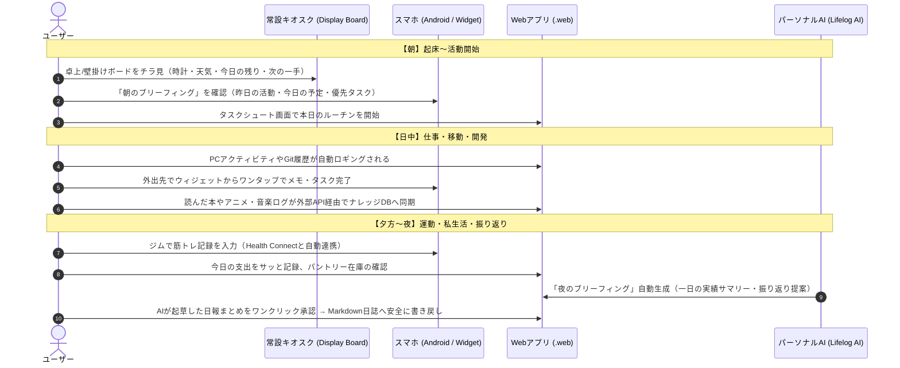
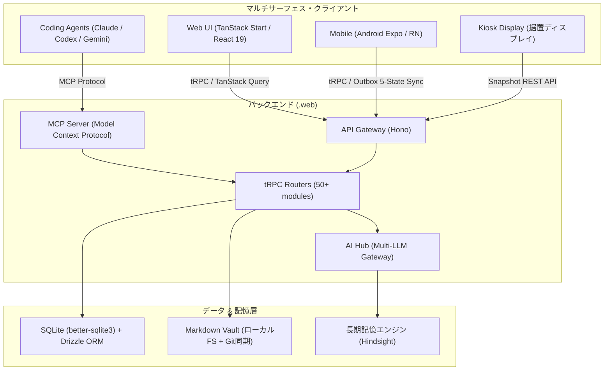

# パーソナルAI統合アプリケーション アーキテクチャ & 機能ガイド

Markdown Vault（Obsidian互換）をSSOT（Single Source of Truth）とし、Webシステム、モバイルコンパニオン、マルチLLMエージェントをシームレスに統合した個人用AI・ライフログ基盤の機能紹介と技術構成。

---

## 1. コンセプト: 何を目指しているのか？

- **データの主権を自分に取り戻す（ローカルファースト & Markdown SSOT）**:
  - クラウドサービスごとにデータが散逸するのを防ぎ、すべての知識、日記、タスク、行動履歴の正本をローカルのMarkdownファイルとSQLiteに集約。
  - 人間が直接エディタで読めるプレーンテキストを基盤とすることで、10年後・20年後も読み続けられる永続性を確保。
- **「生きる」ことと「開発する」ことの境界をなくす**:
  - 日常のタスクシュート・健康記録・カルチャー鑑賞ログ・家計簿から、Gitコミットや技術調査メモまでを単一のWeb/モバイル基盤で連動。
- **安全で手応えのあるAI協調（Human-in-the-Loop）**:
  - AIに丸投げするのではなく、朝夜のブリーフィングやタスク整理、振り返り文章のドラフト作成など「能動的なアシスタント」として活用。
  - 実際のMarkdownファイルへの永続化にはワンクリック承認カード（Action Inbox）を挟み、自分の意思でデータを育てていく。

---

## 2. 1日のリアルな活用シナリオ（ユーザー体験）

システムが日常のサイクルにどう溶け込んでいるのか、1日の流れを通じた実際の活用体験です。

### 朝: 起床〜活動開始
1. **キオスクディスプレイをチラ見**:
   - 部屋の常設モニター（壁掛け/卓上ディスプレイ）に、今日の日付、天気、現在状況、直近のタスクが「Glance Snapshot」としてリアルタイム表示。
2. **朝のAIブリーフィング**:
   - スマホやWebで、前日の睡眠や未完了タスクを踏まえた「今日の作戦」をAIが要約して提示。
3. **タスクシュート開始**:
   - 1日の見積もり終了時刻を見ながら、ルーチンタスクを開始。

### 日中: 仕事・移動・開発
1. **自動ロギングとシームレスな追記**:
   - PCの作業時間やGitのコミット履歴がバックグラウンドで収集。
   - ページ（プロジェクトノート）へのログ追記は `- [[YYYY-MM-DD]] HH:MM メモ` 形式で本文へ素早く追加。
2. **外出時のモバイル活用**:
   - Androidコンパニオンアプリがバックグラウンドで移動ルートや滞在地点を記録。
   - ホーム画面のウィジェットから「次の一手」を確認し、片手でタスクを完了。

### 夜: 運動・私生活・振り返り
1. **アクティビティ & ライフログ入力**:
   - ジムでの筋トレ種目・重量・回数を入力（Android Health Connectへ即座に反映され、心拍数や消費カロリーと統合）。
   - その日に読んだ本（読書メーター連携）や視聴したアニメ（Annict連携）、支出（家計簿機能）をサクッと登録。
2. **夜のAIブリーフィング & 日誌生成**:
   - AIが一日の行動実績（カレンダー・移動・タスク・運動・PC作業）を自動集約し、日次ジャーナル（`journals/YYYY-MM-DD.md`）の決定論セクションへ実績を自動反映。
   - さらに一日の振り返りコメントをAIがドラフト作成し、ユーザーが内容を確認・承認すると正式にMarkdownへ反映。

---

## 3. 具体的にできること（機能カタログ）

### 3.1 ライフログ & タイムトラッキング
- **TaskChute（タスクシュート）型時間管理**:
  - ルーチンタスクと突発タスクを時系列に並べ、現在時刻からの積み上げで「今日の作業終了予測時刻」をリアルタイム計算。
- **地図タイムライン & 移動記録**:
  - GPSログから滞在地点（Stay Point）や移動セグメントを抽出し、自前配信のベクタータイル地図上に描画。
- **PCアクティビティ & スクリーンタイム**:
  - どのウィンドウやプロジェクトに何分使ったかを自動集計し、集中度合いを可視化。
- **健康・フィットネス（筋トレ & ランニング）**:
  - BIG3を中心とした筋トレプログラム管理（1RM推定、ボリューム推移、サイクル計画）。
  - Android Health Connectと完全統合し、端末ローカル主導でアクティビティを安全に管理。

### 3.2 カルチャー & ナレッジデータベース (PKM)
- **Frontmatter構造化データベース**:
  - 書籍、論文、アニメ、映画、人物、所有物（ガジェット・道具）、パントリー（備蓄・消耗品）などをMarkdownのメタデータで管理。
- **外部サービス自動同期**:
  - 読書メーター（本）、Annict（アニメ）、Spotify / Last.fm（音楽）などの外部記録を定期同期し、MarkdownとSQLiteへ集約。
- **ISBN / メタデータ自動補完**:
  - 書籍登録時にISBNやWeb検索から書影・著者・出版社・概要を自動取得。

### 3.3 パーソナルAIアシスタント (Lifelog AI)
- **長期記憶に接地した対話 (Grounded Recall)**:
  - 「先月読んだあの本の感想は？」「以前決めたこの技術の採用理由は？」など、過去の日記や設計ノート、対話履歴から文脈を検索（Recall / Reflect）して回答。
- **朝・夜の能動的ブリーフィング**:
  - ユーザーが質問しなくても、朝は「今日やること」、夜は「今日の実績と振り返り」をAI側から自律的に準備。
- **アクション承認カード (Action Inbox)**:
  - AIが提案したアクション（タスク作成、日報の文章修正、ノート追記など）は独立したカードとしてキューに並び、ユーザーが承認した瞬間にのみ実行。
- **コーディングエージェント連携 (MCP)**:
  - ターミナルで作業するAIエージェント（Claude Code / Codex / Gemini）が、MCPツール経由でVaultのノートを検索・作成したり、タスクを確認・更新できる。

### 3.4 家計・生活管理
- **支出 & 家計簿ドラフト**:
  - 日々の支出を素早く入力。予算やカテゴリごとの推移をダッシュボードで可視化。
- **パントリー & 持ち物管理**:
  - 常備品・日用品のストック残量や、保有しているガジェット・機材のスペック、保証期限などを管理。
- **返信負債（Reply Debt）管理**:
  - 返信が必要な連絡やタスクをカード化し、「今日返す」「後で返す」「放置」などのトリアージを支援。

### 3.5 マルチサーフェス展開
- **デスクトップWeb**: 全機能にフルアクセスできる大画面向けダッシュボード（TanStack Router）。
- **モバイルコンパニオン (Android)**:
  - 外出先からの高速入力、ウィジェット（次の一手、割り込みタスク、クイックメモ）、Wear OSタイル連携。
  - オフラインでもタスク完了やメモが可能（電波復帰時に自動同期）。
- **キオスクディスプレイ (Display Board)**:
  - タブレットや小型モニターを壁掛け・卓上スタンドに置き、部屋の環境情報や今日の一日を常時表示。

---

## 4. 全体アーキテクチャ & 技術構成

### 技術スタック一覧

| レイヤー | 採用技術 | 選定理由・特徴 |
|---|---|---|
| **Webフロントエンド** | TanStack Start, React 19, TanStack Router | フルスタックSSR/SPAハイブリッド、型安全なファイルベースルーティング、最新React機能 |
| **デザインシステム** | Tailwind CSS, Material 3 Expressive | 洗練されたマテリアルデザイントークン設計、直感的な操作感 |
| **API / 通信** | tRPC v11, Hono, TanStack Query | エンドツーエンドの完全型安全性、高速なレスポンス、効率的なキャッシュ管理 |
| **バックエンド言語** | TypeScript (Node >=22) | フロント・バック・共有パッケージ間の型共有（Zod） |
| **データベース** | SQLite (`better-sqlite3`), Drizzle ORM | ローカルファイル1つで完結する軽量性・超高速性、型安全なスキーマ定義 |
| **モバイル** | Expo (~53), React Native (0.79.x) | Android専用コンパニオン、12種のウィジェット、Wear OSモジュール |
| **地図・可視化** | MapLibre GL JS, 自前PMTiles配信 | オフライン/軽量ベクタータイル配信、高速なGPSタイムライン描画 |
| **AI基盤 (AI Hub)** | OpenAI, Anthropic, Google Gemini (Nano含む) | プロバイダー抽象化、モデルキャッシュ、利用量（トークン/コスト）トラッキング |
| **長期記憶** | 外部長期記憶エンジン (Hindsight等) | 知識グラフとベクトル検索の統合、エージェント間での一貫した記憶共有 |
| **エージェント連携** | MCP (Model Context Protocol) | ターミナル上のエージェントからVaultやAPIを直接ツールとして実行 |
| **開発基盤** | Turborepo, pnpm, Docker Compose | 高速なモノレポビルド、コンテナによる環境の完全再現 |

---

## 5. 個人開発・運用のこだわりと設計工夫

### 5.1 Zodスキーマによるエンドツーエンド型安全性
- 型定義と実行時バリデーションの単一情報源（SSOT）を `packages/shared` の Zod スキーマに集約。
- tRPCプロシージャ、DBスキーマ、フロントエンドの入力フォームが完全に同一の型で保護され、リファクタリングが極めて安全。

### 5.2 オフライン耐性と Outbox パターン (モバイル)
- 地下鉄や電波の悪いジムでも、スマホから快適に記録・操作が可能。
- 入力データはローカルSQLiteに即座に保存され、Outboxキュー（Pending → InFlight → Synced / Failed）を通じてオンライン復帰時に安全にサーバーへ送られる。

### 5.3 AI Hub パターン（プロバイダー抽象化）
- 複数のLLM（OpenAI, Gemini, Anthropic等）を単一のインターフェースで呼び出し可能。
- 高速な分類器には軽量モデル、複雑な朝夜の振り返りには推論モデル（Thinking Budget付き）など、タスク特性に応じてモデルを柔軟に切り替え。

### 5.4 プライバシー保護マーカーと3クラスの安全ガード
- **AI不可視化マーカー**:
  - ノート内に `<!-- ai:hidden -->` 〜 `<!-- /ai:hidden -->` で囲んだ区間は、外部LLMやエージェントへ渡すコンテキストから自動的に除外。
- **決定論エリアと叙述エリアの分離**:
  - 日報の自動集約実績（`<!-- auto:facts -->`）と、人間やAIが書く文章エリアを明確に分離し、誤った上書きを構造的に防止。
- **安全な書き込み制限**:
  - 追記専用ログ、承認必須の編集、手動専用ファイルという3つの安全クラスを設け、AIによる予期せぬMarkdownの破壊を防止。

---

## 6. まとめ

本システムは、**「人間が主役のPKM（知識管理）」** と **「能動的にサポートする最新のパーソナルAI」** を高いレベルで融合させた実践的なパーソナルOSです。

Markdownという普遍的なプレーンテキストを土台にすることでデータの永続性と自由度を確保しつつ、React 19 / tRPC / Expo / SQLite / MCP といった現代最高峰のテクノロジースタックをフル活用することで、日々の生活・運動・学習・開発を心地よく支える環境を実現しています。
